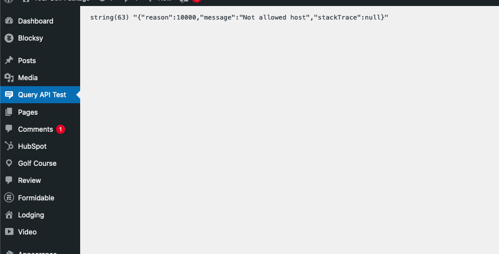
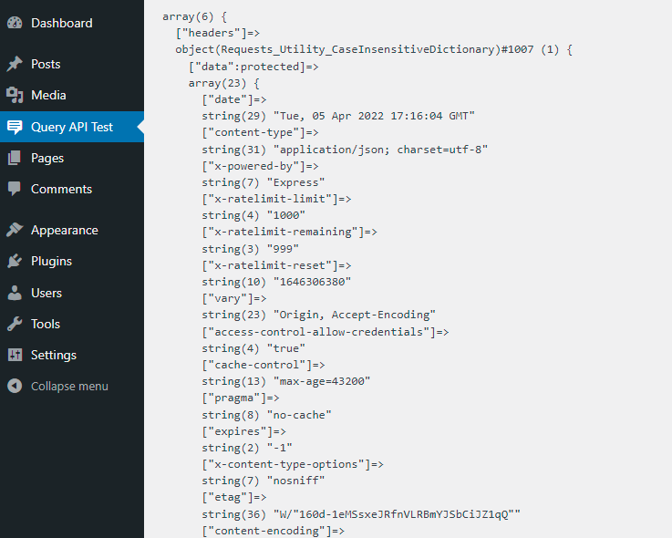

# A Test APIs Result
### Get information from external APIs in WordPress. Click the Query API Test link in the Admin menu on activation.
### We shall be using [jsonplaceholders api](https://jsonplaceholder.typicode.com/users) as an example to fetch data in WordPress.
### Requirements
* Code editor e.g [vscode](https://code.visualstudio.com/download).
* Internet Connection.
### The procedure involves only 3 steps.
* Step 1
    * Open up code editor e.g [vs code](https://code.visualstudio.com/download) and create a custom plugin file with the name of your choice e.g a-test-api.php
* Step 2
    * Declare a function responsible for calling the external Api inside the created plugin file [docs](https://developer.wordpress.org/apis/handbook/making-http-requests/getting-data-from-an-external-service/).
* Step 3
    * Declare a function responsible for creating a custom menu page [docs](https://developer.wordpress.org/reference/functions/add_menu_page/)

## Screenshot

## Downloadables
- Version [0.1.0 download](https://github.com/MediaUganda/A-Test-API/releases/download/0.1.0/a-test-api.zip)
